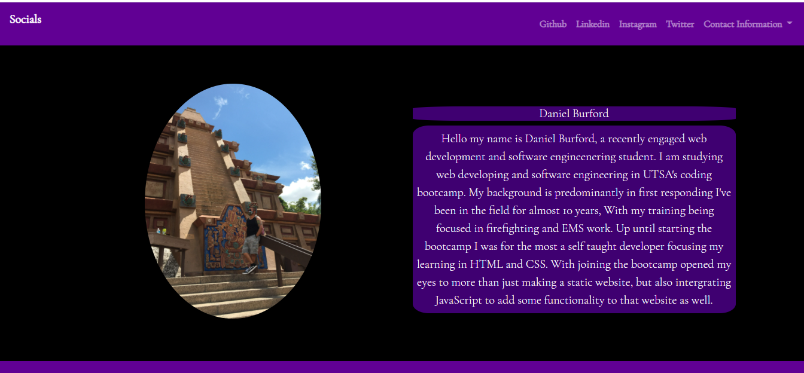
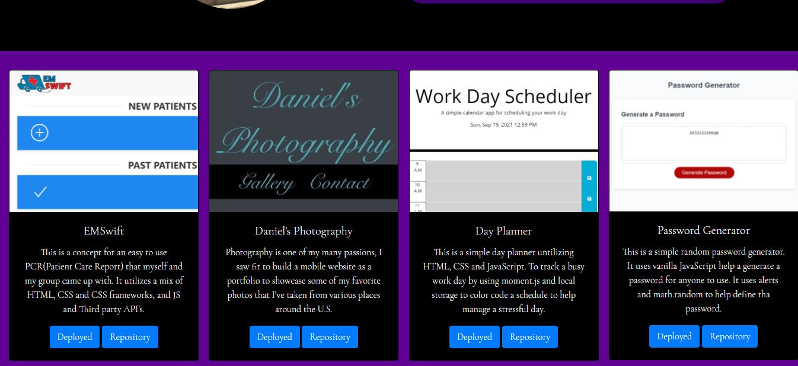
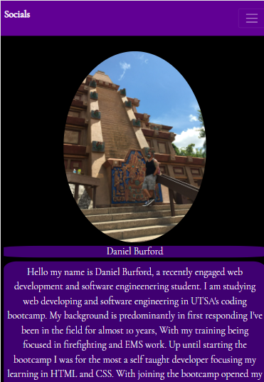

# Daniels Portfolio
[Deployed](https://daniel-burford.com)  
[Repository](https://github.com/dannfirefight322/Daniels_Portfolio) 
### This is a portfolio I put together using HTML and CSS.
### I also used bootstrap to help design my portfolio. 
### I also used a few other technologies such as favicon to add my initials to the tab bar in a web browser, and colorhunt.io to help guide my choices for a color scheme.
### I also used godaddy to obtain a domain consisting of my name to use instead of the default github domain.
### I included a recent picture of me and a sort bio consisting on my experiences.
### Also included are several projects or assigments Ive completed throughtout the course to help practice my skills.
### I also linked all my relevent social media accounts and added my email phone number and resume.
## These are screenshots of the final product of my portfolio.

 
